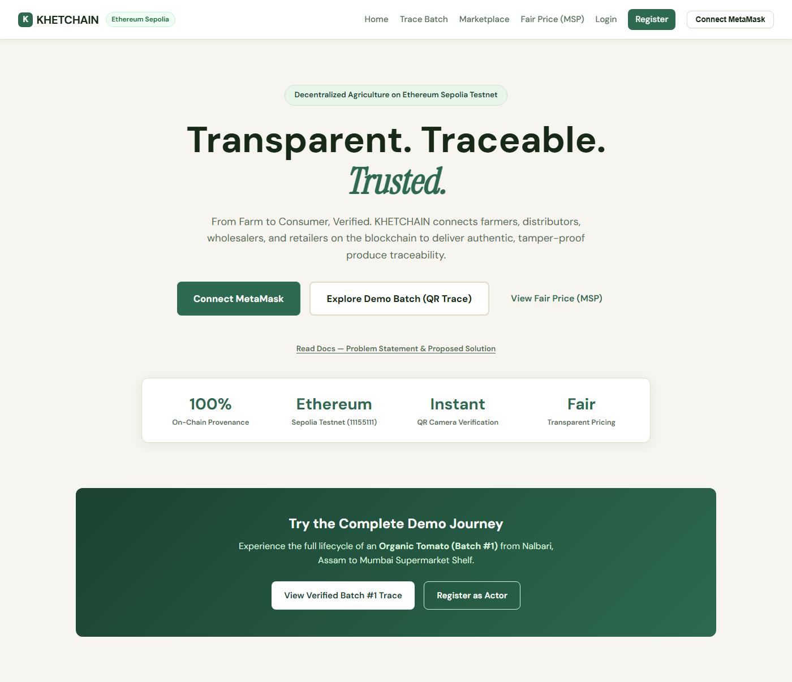
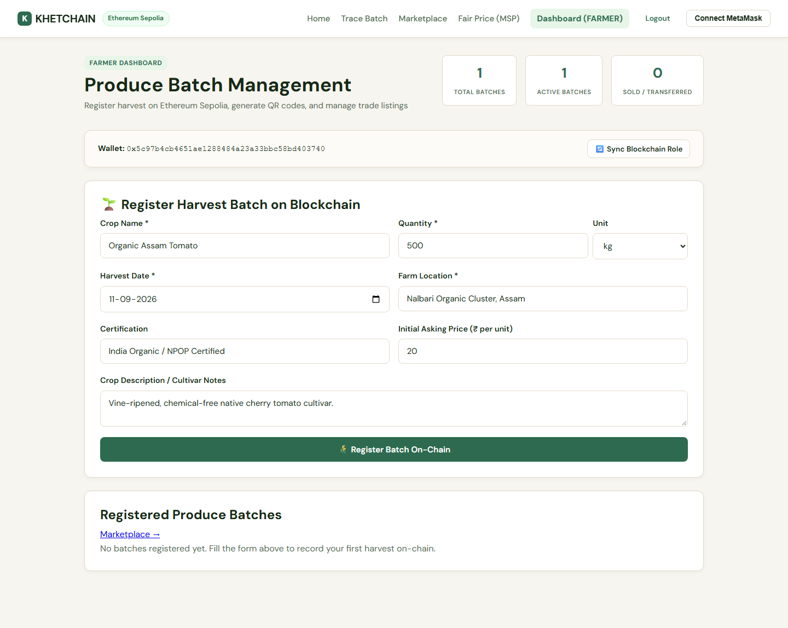
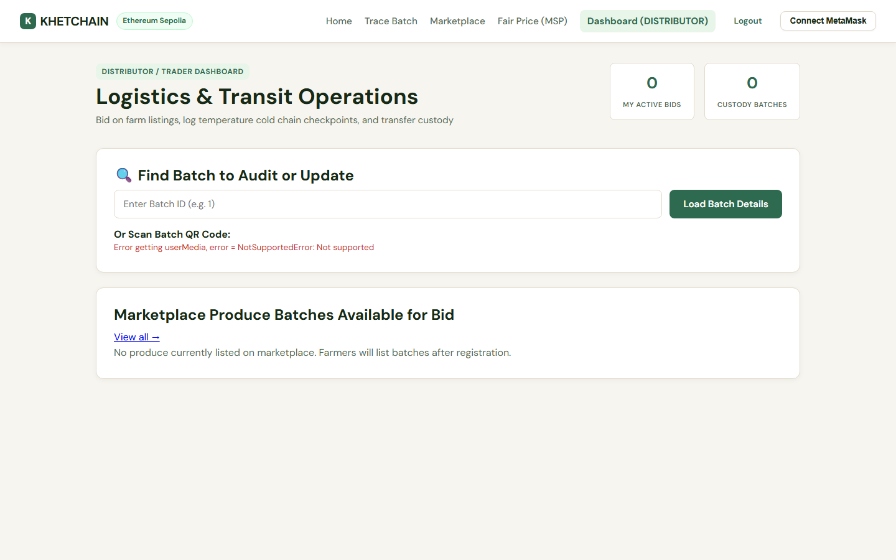
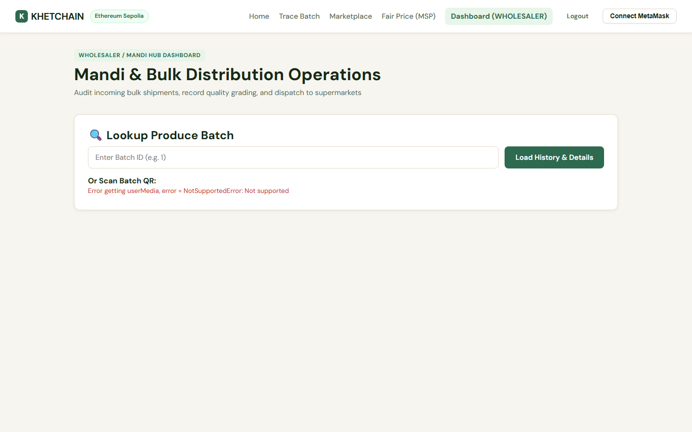
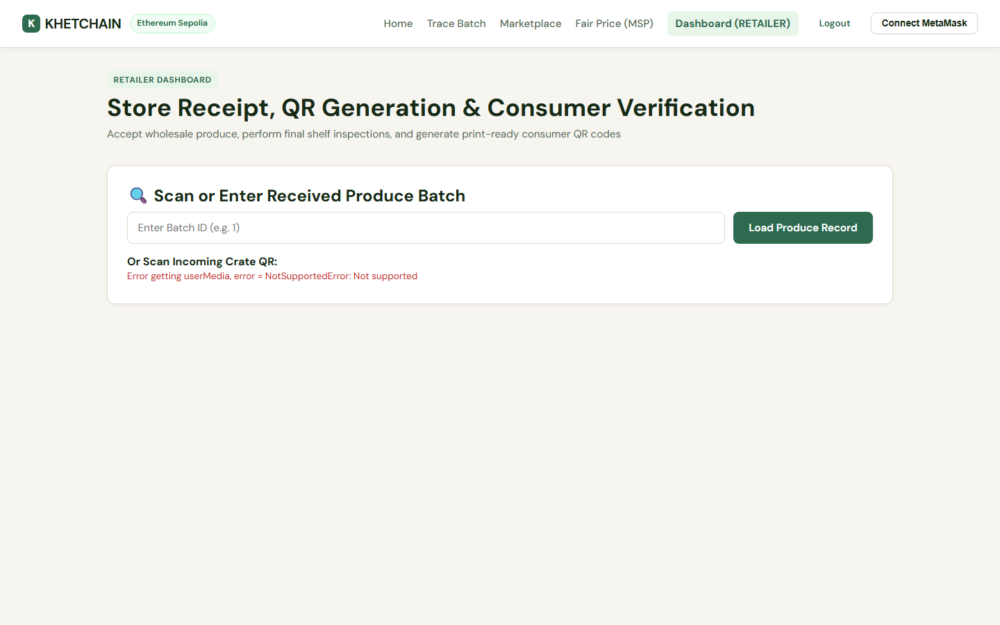

# KhetChain

> Somewhere between the farm and your fridge, the truth gets lost.

A tomato can pass through a farmer, a distributor, a wholesaler, and a retailer before it ever reaches a shelf — and at every handoff, the record of where it came from, what it cost, and how it was handled is whatever the next person chooses to remember. No receipt survives four hands. No phone call is admissible. By the time it's in your basket, "organic," "fresh," and "fairly priced" are just words someone printed on a label.

**KhetChain puts the produce's entire journey on-chain.** Every harvest, every price, every cold-chain checkpoint, every change of ownership — written to Ethereum Sepolia the moment it happens, signed by the wallet of the person who did it, and impossible to quietly edit afterward. A consumer scans one QR code and sees the whole thing: farm, farmer, price at every stage, quality checks, and the timestamped chain of custody, all the way back to harvest. No login, no wallet, no app.

Built for the **PS451** problem statement — see [`PS451.pdf`](PS451.pdf) for the original problem statement and proposed solution, also linked from the app's home page.

## See it

| Landing Page | Farmer Dashboard |
|---|---|
|  |  |

| Distributor Dashboard | Wholesaler Dashboard | Retailer Dashboard |
|---|---|---|
|  |  |  |

## The Chain of Custody

```
Farmer  →  Distributor  →  Wholesaler  →  Retailer  →  QR  →  Consumer
```

1. **Farmer** harvests and registers a batch on-chain — crop, quantity, location, certification, asking price. This is the batch's birth certificate.
2. **Distributor** browses the marketplace and places an ETH-escrowed bid; once the farmer accepts, ownership transfers on-chain and the bid amount is released. The distributor then logs transport and cold-chain checkpoints as the batch moves.
3. **Wholesaler** receives the shipment at a mandi/hub, records a storage and quality audit, and takes custody.
4. **Retailer** performs the final quality inspection, lists the batch in inventory, and activates its public QR code.
5. **Consumer** scans the QR code on the shelf — no wallet, no login, no app install — and sees the full, verified journey: every actor, every price, every quality checkpoint, every timestamp, sourced straight from the blockchain.

Every step above is a real transaction on a public testnet. Nothing here is a mock.

## What's actually on-chain

Not just "a hash of a database row" — the full picture, per batch:

- Crop, quantity, unit, harvest date, location, certification
- Current owner and full ownership-transfer history
- Price at every stage of the chain (farmgate → distributor → wholesaler → retail)
- Quality checkpoints (`GOOD` / `MEDIUM` / `BAD`) logged by whoever holds custody at the time
- Transport and storage details (vehicle, temperature, humidity, facility)
- A QR-verifiable hash unique to the batch, checked against what's actually on-chain when a consumer scans it

## Stack

- **Contracts:** Solidity 0.8, Hardhat, OpenZeppelin AccessControl / ReentrancyGuard / Pausable — deployed on **Ethereum Sepolia**
- **Backend:** Node.js, Express, MongoDB (or in-memory for zero-setup local dev), ethers.js, JWT + wallet-signature auth, on-chain event indexing
- **Frontend:** React (Vite), TypeScript, ethers.js, html5-qrcode
- **Wallet:** Real MetaMask transactions only — no fabricated tx hashes, no fake confirmations

## Quick Start (Local)

### 1. Install dependencies

```bash
npm run install:all
```

### 2. Compile & test the contract

```bash
npm run compile
npm run test:contracts
```

### 3. Start a local Hardhat node (terminal 1)

```bash
npm run node
```

### 4. Deploy the contract locally (terminal 2)

```bash
npm run deploy:local
```

This auto-syncs the ABI to `frontend/src/abi` and `backend/src/abi`, and prints the deployed address.

### 5. Configure environment variables

Copy `.env.example` to `.env` in the repo root, `backend/.env`, and `frontend/.env`, filling in the contract address printed above. For zero-setup local dev, set `USE_MEMORY_DB=true` in `backend/.env` — no MongoDB install required. To use a real MongoDB instead: `docker compose up -d`.

### 6. Start the backend (terminal 3)

```bash
npm run dev:backend
```

### 7. Start the frontend (terminal 4)

```bash
npm run dev:frontend
```

Open http://localhost:5173

## Sepolia Deployment

1. Get a deployer wallet funded with Sepolia test ETH — e.g. the [Google Cloud Web3 faucet](https://cloud.google.com/application/web3/faucet/ethereum/sepolia), [Alchemy's Sepolia faucet](https://www.alchemy.com/faucets/ethereum-sepolia), or [QuickNode's](https://faucet.quicknode.com/ethereum/sepolia).
2. Set `SEPOLIA_RPC_URL` and `DEPLOYER_PRIVATE_KEY` in `contracts/.env`.
3. `cd contracts && npm run deploy:sepolia`
4. Update `RPC_URL`, `CHAIN_ID=11155111`, and the printed contract address in `backend/.env` and `frontend/.env`.

## API (prefix `/api/v1`)

| Method | Route | Auth |
|--------|-------|------|
| POST | `/auth/nonce` | Public |
| POST | `/auth/register` | Public + wallet signature |
| POST | `/auth/login` | Public + wallet signature |
| GET | `/auth/me` | Authenticated |
| POST | `/auth/sync-role` | Authenticated |
| GET | `/auth/role-status` | Authenticated |
| POST | `/batch` | Farmer (sync after on-chain tx) |
| GET | `/batch` | Authenticated (optional) |
| GET | `/batch/:id` | Public |
| GET | `/batch/:id/verify` | Public |
| GET | `/batch/:id/history` | Public |
| POST | `/supplychain/event` | Authenticated |
| GET | `/supplychain/:batchId` | Public |
| GET | `/qr/:batchId` | Public |
| POST | `/listing` | Farmer |
| GET | `/listing` | Public |
| POST | `/bid` | Distributor |
| POST | `/bid/accept` | Farmer |
| GET | `/bid/:batchId` | Farmer |
| POST | `/transfer` | Distributor / Retailer |
| POST | `/status` | Distributor / Retailer |
| GET | `/history/:id` | Public |
| GET | `/dashboard/stats` | Authenticated |

## Architecture

Every write is signed by the acting user's own MetaMask wallet — the backend never signs a transaction on a user's behalf. The backend indexes confirmed transactions by `txHash`, listens for contract events to keep a MongoDB search/cache layer warm, and serves public reads (batch lookups, QR verification, history) without requiring a wallet at all. The blockchain is the single source of truth; MongoDB is a convenience index on top of it, never the record itself.
